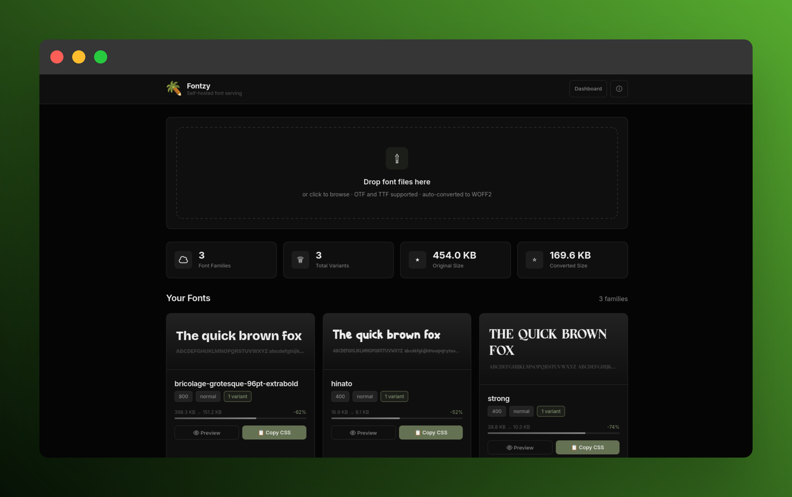

## What is Fontzy ?

**Self-hosted font serving that feels like Google Fonts — but the fonts are yours.**

Upload your OTF/TTF files. Get a WOFF2-converted, subset-optimized, cache-busted `@import` URL. Host everything yourself.



---

## What it does

| Google Fonts | Fontzy |
|--------------|--------|
| Pulls from Google's CDN | Serves **your** font files |
| Tracks visitors | **Zero** external requests |
| Limited to Google catalog | Any OTF/TTF you own |
| No control over subsetting | Latin-subset WOFF2 by default |

Fontzy replicates the *developer experience* of Google Fonts (`@import url(...)`) while giving you full control over the files, performance, and privacy.

---

## Features

- **Drag & drop upload** — Drop `.otf` or `.ttf` files on the dashboard. Done.
- **Auto-conversion to WOFF2** — Uses `fonttools` + `brotli`. ~60% smaller files.
- **Latin subsetting** — Strips unused glyphs. Even smaller.
- **CSS on demand** — `GET /api/font?family=YourFont` returns `@font-face` rules.
- **Weight/style filtering** — Request only the variants you need.
- **Immutable caching** — Font files cached for 1 year. CSS cached for 1 hour.
- **Beautiful dashboard** — Live font previews, size stats, copy-paste URLs.
- **Docker ready** — One command to run.
- **Custom domain support** — Configure a public base URL for use behind a reverse proxy or tunnel.

---

## Quick Start

### Docker (recommended)

```bash
git clone https://github.com/yourusername/fontzy.git
cd fontzy
docker compose up --build -d
```

Open **http://localhost:8000**

### Local (Python 3.12+)

```bash
# Install dependencies
uv venv --python 3.12
source .venv/bin/activate
uv pip install -e .

# Start server
uvicorn app.main:app --host 0.0.0.0 --port 8000 --reload
```

---

## Usage

### 1. Upload a font

Drag a `.ttf` or `.otf` onto the dashboard, or use the API:

```bash
curl -X POST -F "files=@YourFont.ttf" http://localhost:8000/api/upload
```

### 2. Copy the CSS import

Click **Copy CSS** on any font card, or construct the URL yourself:

```css
@import url('http://localhost:8000/api/font?family=your-font');
```

### 3. Use it

```css
@import url('http://localhost:8000/api/font?family=your-font');

body {
  font-family: 'your-font', sans-serif;
}
```

### 4. Request specific weights

```css
@import url('http://localhost:8000/api/font?family=your-font&weight=400,700');
```

---

## API Reference

| Endpoint | Method | Description |
|----------|--------|-------------|
| `/` | GET | Dashboard — upload, browse, preview |
| `/api/font` | GET | `@font-face` CSS. Query: `family`, `weight`, `style` |
| `/api/upload` | POST | Upload `.otf`/`.ttf` files (multipart) |
| `/api/families` | GET | List all indexed font families |
| `/api/font/{family}` | DELETE | Remove a family and its files |
| `/fonts/{family}/{file}` | GET | Raw WOFF2 file (immutable cache) |
| `/assets/*` | GET | Static assets (favicon, logo) |
| `/api/settings` | GET | Read current base URL |
| `/api/settings` | POST | Update base URL (`{"base_url": "..."}`) |

---

## Configuration

All paths are configurable via environment variables:

| Variable | Default | Description |
|----------|---------|-------------|
| `FONTZY_INCOMING_DIR` | `./fonts/incoming` | Upload staging |
| `FONTZY_SERVED_DIR` | `./fonts/served` | Converted WOFF2 output |
| `FONTZY_SETTINGS_FILE` | `./fontzy-settings.json` | App settings (base URL) |

Subsets are defined in `app/config.py`. Default is **Latin** (~300 glyphs). Add `latin-ext`, `cyrillic`, or `greek` as needed.

---

## Using Behind a Reverse Proxy or Tunnel

Fontzy supports configuring a custom base URL so that all generated `@import` URLs point to your public domain.

### Via the Dashboard

1. Open Fontzy in your browser
2. Click the **⚙️ Settings** button in the header
3. Enter your public URL (e.g., `https://fonts.example.com`)
4. Click **Save**

All CSS imports, font file references, and copy-paste URLs will use this domain.

### Via the API

```bash
# Set base URL
curl -X POST http://localhost:8000/api/settings \
  -H "Content-Type: application/json" \
  -d '{"base_url": "https://fonts.example.com"}'

# Verify
curl http://localhost:8000/api/settings
# → {"base_url":"https://fonts.example.com"}
```

### How it works

- **Auto-detect** — If no base URL is configured, Fontzy derives it from the incoming request (e.g., `http://localhost:8000`)
- **Manual override** — Setting a base URL forces all generated URLs to use that domain
- **Persistence** — Saved to `fontzy-settings.json`, persists across container restarts
- **Impact** — Dashboard copy buttons, detail page CSS blocks, and `@font-face` font file URLs all use the configured domain

---

## Docker Compose

```yaml
services:
  fontzy:
    build: .
    ports:
      - "8000:8000"
    volumes:
      - ./fonts:/app/fonts
      - ./font-metadata.json:/app/font-metadata.json
    environment:
      - FONTZY_INCOMING_DIR=/app/fonts/incoming
      - FONTZY_SERVED_DIR=/app/fonts/served
    restart: unless-stopped
```

Volumes ensure your fonts, index, and settings persist across container restarts.

---

## Notes

- **Licensing is your responsibility.** Only upload fonts you have the right to use.
- Designed for single sites or small deployments. For high-traffic global use, add a CDN in front.
- Font metadata is parsed from the font's `name` table. Some fonts may need manual name cleanup.

---

## License

This project is open source and under the "Good Luck With That" License.

---

## AI Usage

I didn't 'Vibe code' this project. I've made it.
This project have been made with my own hands assisted with AI. It's my copilot. It helped me plan the project, chose the techical stack and debug horrible bugs.
